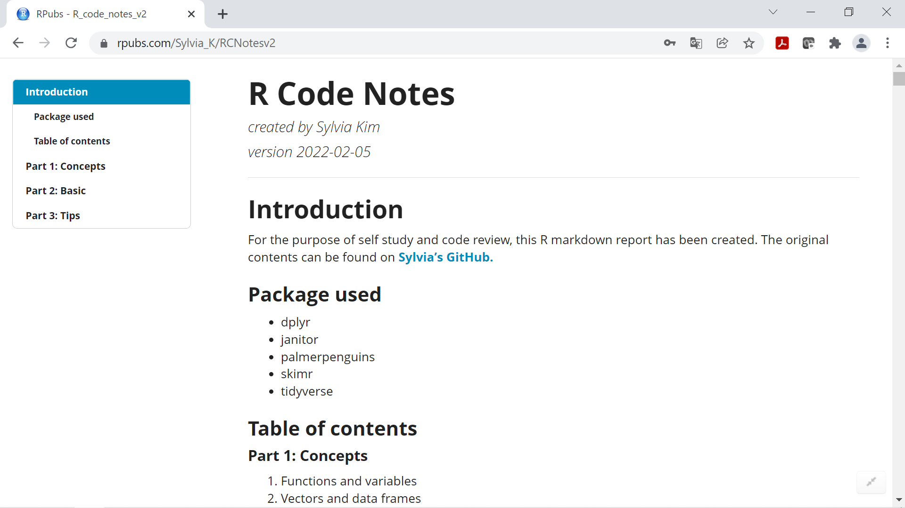
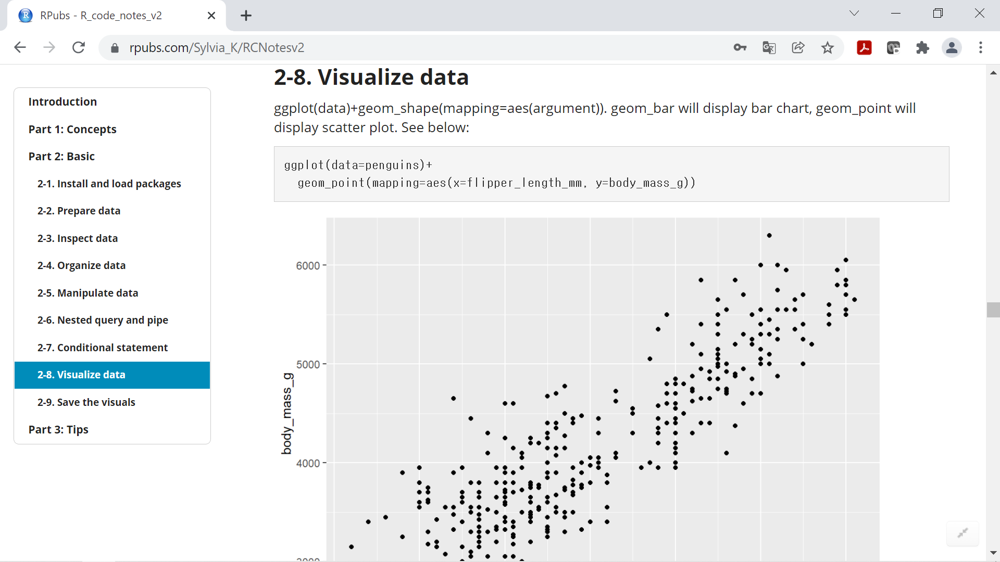

# R-practice
For the purpose of self study and code review, R markdown report has been created. 
It will show the code results such as data frame or visuals. Check out full report by *clicking* images below.

<table>
  <tr>
    <td> Screenshot#1</td>
    <td> Screenshot#2</td>
   </tr>
   
<tr>
  <td></img></td>
  <td></img></td>
  </tr>

</table>
